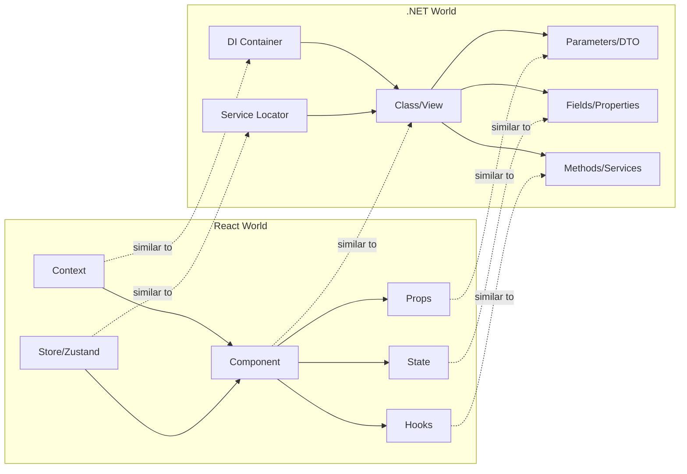

# React ↔ .NET Mental Model

This guide maps React concepts to their .NET equivalents to help backend developers build intuition.

---

## Core Concept Map



---

## Detailed Mapping

### Components = Classes/Views

```typescript
// React Component
function UserCard({ name, email }: UserProps) {
  return <div>{name} - {email}</div>;
}
```

```csharp
// C# Razor Component
@code {
    [Parameter] public string Name { get; set; }
    [Parameter] public string Email { get; set; }
}
<div>@Name - @Email</div>
```

---

### Props = DTOs / Method Parameters

```typescript
// React Props
interface UserProps {
  id: number;
  name: string;
  email?: string;  // Optional
}
```

```csharp
// C# DTO
public record UserDto(
    int Id,
    string Name,
    string? Email = null  // Optional
);
```

---

### State = Private Fields

```typescript
// React State
function Counter() {
  const [count, setCount] = useState(0);
  return <button onClick={() => setCount(c => c + 1)}>{count}</button>;
}
```

```csharp
// C# Private Field
public class Counter {
    private int _count = 0;
    public void Increment() => _count++;
}
```

---

### Context = Dependency Injection

```typescript
// React Context
const AuthContext = createContext<AuthState | null>(null);
const useAuth = () => useContext(AuthContext);

// In component
const { user } = useAuth();
```

```csharp
// .NET DI
services.AddScoped<IAuthService, AuthService>();

// In controller
public class HomeController(IAuthService auth) {
    // auth is injected
}
```

---

### Custom Hooks = Service Classes

```typescript
// React Hook
function useUsers() {
  const [users, setUsers] = useState<User[]>([]);
  const fetchUsers = async () => { /* ... */ };
  return { users, fetchUsers };
}
```

```csharp
// .NET Service
public class UserService : IUserService {
    public List<User> Users { get; private set; }
    public async Task FetchUsersAsync() { /* ... */ }
}
```

---

### useEffect = Lifecycle Methods

| React | .NET |
|-------|------|
| `useEffect(() => {}, [])` | `OnInitializedAsync()` |
| `useEffect(() => {}, [dep])` | `OnParametersSet()` |
| `useEffect(() => () => {}, [])` | `IDisposable.Dispose()` |

---

### React Query = Repository + Cache

```typescript
// React Query
const { data, isLoading } = useQuery({
  queryKey: ['users'],
  queryFn: () => api.getUsers()
});
```

```csharp
// .NET Repository + Cache
public class CachedUserRepository : IUserRepository {
    private readonly IMemoryCache _cache;
    private readonly IUserRepository _inner;
    
    public async Task<List<User>> GetUsersAsync() {
        return await _cache.GetOrCreateAsync("users", 
            async entry => await _inner.GetUsersAsync());
    }
}
```

---

## State Management Comparison

| Pattern | React | .NET |
|---------|-------|------|
| Local state | `useState` | Private field |
| Computed | `useMemo` | Property getter with caching |
| Global state | Context/Zustand | DI Singleton/Scoped |
| Actions | Dispatch/Callbacks | Commands/MediatR |
| Selectors | Zustand selectors | Projections |

---

## Validation Comparison

| Feature | React (Zod) | .NET (FluentValidation) |
|---------|-------------|------------------------|
| Required | `z.string().min(1)` | `RuleFor(x => x.Name).NotEmpty()` |
| Email | `z.string().email()` | `RuleFor(x => x.Email).EmailAddress()` |
| Min length | `z.string().min(8)` | `RuleFor(x => x.Password).MinLength(8)` |
| Custom | `z.refine(val => ...)` | `RuleFor(x => x).Must(x => ...)` |

---

## Key Differences to Remember

1. **React is declarative**: You describe *what* should render, not *how*
2. **Immutable updates**: Always create new objects, never mutate
3. **Unidirectional data flow**: Data flows down via props, events flow up
4. **Hooks are composable**: Build complex features from simple hooks
5. **Client-side only**: No server-side state (unless using Next.js/SSR)

---

## When to Apply .NET Knowledge

| Apply | Learn New |
|-------|-----------|
| SOLID principles | Virtual DOM reconciliation |
| Clean architecture | React rendering cycle |
| TypeScript types ≈ C# types | JSX syntax |
| async/await (same) | useEffect dependencies |
| Testing patterns | Testing Library queries |
| REST API design | React Query patterns |

---

## Quick Translation Table

| Doing this in .NET? | In React, use... |
|---------------------|------------------|
| Injecting a service | `useContext` or Zustand |
| Making an API call | React Query or `fetch` |
| Validating a form | React Hook Form + Zod |
| Caching data | React Query cache |
| Routing | React Router |
| State machine | `useReducer` |
| Background task | `useEffect` with cleanup |
